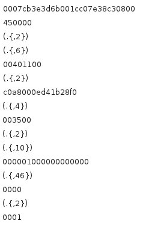

.. currentmodule:: netzob

.. _vocabular:

Vocabular inference
###################

Structure inference
*******************

Regoupment of similar structures
********************************

Options during alignment process
================================

* "read-only” process (do not require a participation in the
  communication).
* Identify the fixed and dynamic fields of all the messages.
* Regroups equivalent messages depending of their field structures.

* Clustering (Regroups equivalent messages using) :
	* an UPGMA Algorithm to regroup similar messages
	* an openMP and MPI implementation 

* Sequencing, Alignment (Identification of fields in messages) :
	* Needleman & Wunsch Implementation 

Needleman and Wunsch algorithm
==============================

* Originaly a bio-informatic algorithm (sequencing DNA)
* Align two messages and identify common patterns and field structure
* Computes an alignment score representing the efficiency of the
  alignment

The following picture shows the sequence alignment of two messages.

.. image:: ExampleOfAligning.png
    :alt: Example of sequence alignment

UPGMA algorithm
===============

* Identify equivalent messages based on their alignment score.
* Build a hierarchical organization of the messages with the UPGMA
  algorithm (Unweighted Pair Group Method with Arithmetic Mean)

The following picture shows a regroupment of similar messages based on the result of the clustering process.

.. image:: ExampleOfMultipleAlignment.png
    :alt: Example of clustering

Abstraction of a set of message
===============================

The abstraction is the process of substituting the dynamic fields with their representation as a regex. An example of abstraction is shown on the follinw picture.

Analyses after alignment process
================================
aaa

Message contextual menu
=======================
aaa

Group contextual menu
=====================
aaa

Refine regexes
==============
aaa

Slick regexes
=============
aaa

Concatenate
===========
aaa

Split column
============
aaa

Merge columns
=============
aaa

Delete message
==============
aaa

Field type inference
********************

Visualization options
=====================
aaa

Type structure contextual menu
==============================
aaa

Messages distribution
=====================

This function shows a graphical representation of the distribution of bytes per offset for each message of the current group. This function helps to identify entropy variation of each fields. Entropy variation combined with byte distribution help the user to infer the field type.

[INCLUDE GRAPH]

Data typing
===========

* Primary types : binary, ascii, num, base64...
	* Definition domain, unique elements and intervals
	* Data carving (tar gz, png, jpg, ...)
	* Semantic data identification (emails, IP ...)

Domain of definition
====================
aaa

Change type representation
==========================
aaa

Field dependencies from the same message and from the environment
*****************************************************************

Fields dependancies identification
==================================

* Length fields and associated payloads
* Encapsulated messages identifications

And from the environment...

Payload extraction
==================

The function "Find Size Fields", as its name suggests, is dedicated to find fields that contain any length value as well as the associated payload. It does this on each group. Netzob supports different encoding of the size field : big and little endian binary values are supported through size of 1, 2 and 4 bytes. The algorithm used to find the size fields and their associated payloads is desribed in the table XXX.

[INCLUDE ALGORITHM]

The following picture represents the application of the function on a trace example. It shows the automated extraction of the IP and UDP payloads from an Ethernet frame.

.. image:: payload_extraction.png
    :alt: Payload extraction

Field semantic inference
************************

Data carving
============

Data carving is the process of extracting semantic information from fields or messages. Netzob can extract the following semantic information :

* URL
* email
* IP address

[INCLUDE FIGURE]

Search
======
aaa

Properties
==========
aaa
